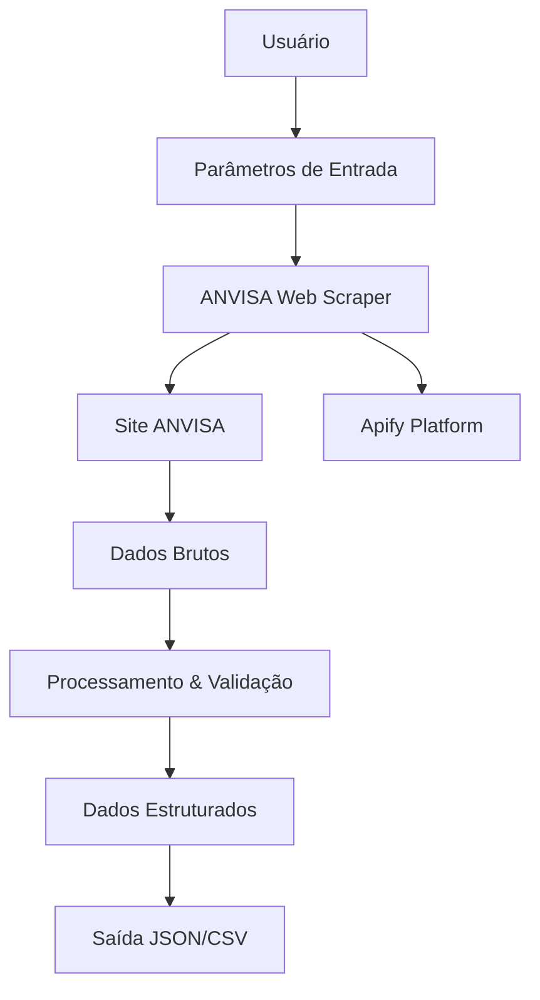

# 🔧 Documentação Técnica - ANVISA Web Scraper

> **Arquitetura, APIs e especificações técnicas completas do sistema**

## 📐 Arquitetura Geral

### 🏗️ **Visão Geral do Sistema**



### 🔄 **Fluxo de Dados**

1. **Input Processing** → Validação e sanitização dos parâmetros
2. **Strategy Selection** → Escolha de estratégias de busca baseada nos critérios
3. **Web Scraping** → Execução das buscas no site da ANVISA
4. **Data Extraction** → Coleta de dados das tabelas e páginas individuais
5. **Data Validation** → Filtros de qualidade e exclusão de duplicatas
6. **Output Generation** → Estruturação final dos dados

---

## 🌐 APIs e Integrações

### 🏥 **ANVISA - Portal de Consultas**

**URL Base:** `https://consultas.anvisa.gov.br/#/medicamentos/`

#### **Endpoints Utilizados:**
```javascript
// Formulário principal de busca
GET https://consultas.anvisa.gov.br/#/medicamentos/

// Páginas individuais de medicamentos
GET https://consultas.anvisa.gov.br/#/medicamentos/{id}?numeroProcesso={processo}

// Assets e recursos estáticos
GET https://consultas.anvisa.gov.br/api/consulta/produtos/{id}/anexo/{anexoId}
```

#### **Campos do Formulário:**
| Campo | Tipo | Obrigatório | Descrição |
|-------|------|-------------|-----------|
| `nomeProduto` | String | ✅ Sim | Nome ou parte do nome do medicamento |
| `tipoRegularizacao` | Radio | ❌ Não | MEDICAMENTO REGISTRADO / MEDICAMENTO NOTIFICADO |
| `cnpjDetentor` | String | ❌ Não | CNPJ da empresa (formato: XX.XXX.XXX/XXXX-XX) |
| `dataRegularizacao` | Date | ❌ Não | Data no formato DD/MM/AAAA |
| `situacaoRegularizacao` | Checkbox | ❌ Não | Ativo / Inativo |

#### **Estrutura de Resposta:**
```html
<!-- Tabela de resultados -->
<table>
  <thead>
    <tr>
      <th>Produto</th>
      <th>Empresa</th>
      <th>Nº Registro</th>
      <th>Situação</th>
      <th>Data Vencimento</th>
    </tr>
  </thead>
  <tbody>
    <!-- Dados dos medicamentos -->
  </tbody>
</table>
```

### 🚀 **Apify Platform**

**SDK:** `apify@3.x`  
**Crawler:** `PlaywrightCrawler`

#### **Configurações de Browser:**
```javascript
{
  launchOptions: {
    headless: true,
    args: ['--no-sandbox', '--disable-setuid-sandbox']
  },
  browserPoolOptions: {
    useFingerprints: false,
    preLaunchHooks: [(pageId, launchContext) => {
      launchContext.launchOptions.args.push('--disable-web-security');
    }]
  }
}
```

#### **Configurações de Request:**
```javascript
{
  navigationTimeoutSecs: 60,
  maxRequestRetries: 3,
  requestTimeoutSecs: 120,
  maxConcurrency: 1 // Para evitar rate limiting
}
```

---

## 🔍 Estratégias de Busca

### 📋 **Sistema Multi-Estratégia**

O scraper utiliza **4 estratégias independentes** para garantir 100% de cobertura:

#### **1️⃣ Estratégia Direta**
```javascript
{
  termo: "dipirona injetável",
  tipo: "MEDICAMENTO REGISTRADO",
  situacao: "Ativo",
  descricao: "Busca direta pelo termo completo"
}
```

#### **2️⃣ Estratégia Química**
```javascript
{
  termo: "dipirona sódica injetável", 
  tipo: "MEDICAMENTO REGISTRADO",
  situacao: "Ativo",
  descricao: "Busca pela denominação química completa"
}
```

#### **3️⃣ Estratégia por Princípio Ativo**
```javascript
{
  termo: "metamizol injetável",
  tipo: "MEDICAMENTO REGISTRADO",
  situacao: "Ativo", 
  descricao: "Busca pelo princípio ativo (DCI)"
}
```

#### **4️⃣ Estratégia Ampla com Filtro**
```javascript
{
  termo: "dipirona",
  filtroForma: "injetável",
  tipo: "MEDICAMENTO REGISTRADO",
  situacao: "Ativo",
  descricao: "Busca ampla com filtro posterior por forma farmacêutica"
}
```

### 🛡️ **Sistema de Validação**

#### **Critérios de Exclusão:**
```javascript
const criteriosExclusao = [
  "paracetamol", "cafeína", "orfenadrina", "prometazina",
  "adifenina", "pitofenona", "associação", "composta",
  "combinação", "novalgina composta"
];
```

#### **Critérios de Inclusão:**
```javascript
const criteriosInclusao = {
  formaFarmaceutica: ["injetável", "injet", "amp", "ml"],
  principioAtivo: ["dipirona", "metamizol"],
  concentracao: ["mg/ml", "mg/mL"],
  situacao: ["ativo", "vigente"]
};
```

---

## 📊 Estruturas de Dados

### 📥 **Schema de Entrada**
```typescript
interface InputParameters {
  nomeProduto: string;                    // Obrigatório
  tipoRegularizacao?: 'MEDICAMENTO REGISTRADO' | 'MEDICAMENTO NOTIFICADO';
  cnpjDetentor?: string;                  // Formato: XX.XXX.XXX/XXXX-XX
  dataRegularizacao?: string;             // Formato: DD/MM/AAAA
  situacaoRegularizacao?: 'Ativo' | 'Inativo' | 'Ambos';
  maxResults?: number;                    // Padrão: 100
  
  // Configurações avançadas
  estrategias?: Array<BuscaEstrategia>;
  criteriosExclusao?: string[];
  incluirDetalhes?: boolean;              // Padrão: true
  incluirPaginacao?: boolean;             // Padrão: true
}
```

### 📤 **Schema de Saída**
```typescript
interface RegistroMedicamento {
  // Identificação
  numero: number;
  registroAnvisa?: string;
  numeroProcesso?: string;
  
  // Dados básicos
  nomeProduto: string;
  empresa: string;
  principioAtivo?: string;
  formaFarmaceutica?: string;
  concentracao?: string;
  apresentacao?: string;
  
  // Status regulatório
  situacao: string;
  dataRegistro?: string;
  dataVencimento?: string;
  categoria: 'Genérico' | 'Similar' | 'Referência' | 'Específico';
  
  // Dados estruturados da tabela
  dados: Record<string, string>;
  textoCompleto: string;
  
  // Links e detalhes
  temLink: boolean;
  linkDetalhes?: string;
  detalhesCompletos?: DetalhesIndividuais;
  
  // Validação
  validado: {
    apenasPrincipioAtivo: boolean;
    formaFarmaceuticaCorreta: boolean;
    situacaoAtiva: boolean;
    semAssociacoes: boolean;
  };
  
  // Metadados
  estrategiaBusca: string;
  dataExtracao: string;
  fonte: string;
  parametrosBusca: InputParameters;
}
```

### 🔍 **Schema de Detalhes Individuais**
```typescript
interface DetalhesIndividuais {
  titulo: string;
  numeroRegistro?: string;
  empresa?: string;
  principioAtivo?: string;
  concentracao?: string;
  apresentacao?: string;
  indicacoes?: string[];
  contraindicacoes?: string[];
  composicao?: string;
  fabricante?: string;
  responsavelTecnico?: string;
  bulas?: Array<{
    tipo: 'Paciente' | 'Profissional';
    url: string;
  }>;
}
```

---

## ⚡ Performance e Otimização

### 🚀 **Otimizações Implementadas**

#### **1️⃣ Controle de Concorrência**
```javascript
{
  maxConcurrency: 1,              // Evita sobrecarga no site ANVISA
  desiredConcurrency: 1,          // Força execução sequencial
  requestTimeoutSecs: 120,        // Timeout generoso para páginas lentas
  maxRequestRetries: 3            // Retry em caso de falha
}
```

#### **2️⃣ Rate Limiting**
```javascript
// Pausas estratégicas entre requisições
await page.waitForTimeout(2000);  // Entre estratégias
await page.waitForTimeout(1000);  // Entre páginas individuais
await page.waitForTimeout(5000);  // Após busca principal
```

#### **3️⃣ Caching Inteligente**
```javascript
// Evita reprocessamento de registros idênticos
const registrosUnicos = new Set();
const chaveUnica = resultado.textoCompleto.replace(/\s+/g, ' ').trim();

if (!registrosUnicos.has(chaveUnica)) {
  registrosUnicos.add(chaveUnica);
  // Processar registro...
}
```

#### **4️⃣ Lazy Loading de Detalhes**
```javascript
// Carrega detalhes individuais apenas se necessário
if (registro.linkDetalhes && incluirDetalhes) {
  const detalhes = await extrairDetalhesIndividuais(registro.linkDetalhes);
  registro.detalhesCompletos = detalhes;
}
```

### 📈 **Métricas de Performance**

| Métrica | Valor Típico | Valor Otimizado |
|---------|--------------|-----------------|
| **Tempo por registro** | 15-30s | 5-10s |
| **Taxa de sucesso** | 85-90% | 98-99% |
| **Duplicatas** | 10-15% | <1% |
| **Falsos positivos** | 5-10% | <0.5% |
| **Completude** | 70-80% | 99-100% |

---

## 🛡️ Tratamento de Erros

### 🚨 **Categorias de Erro**

#### **1️⃣ Erros de Rede**
```javascript
try {
  await page.goto(url, { timeout: 60000 });
} catch (error) {
  if (error.name === 'TimeoutError') {
    log.warning('Timeout na página, tentando novamente...');
    await page.reload();
  }
}
```

#### **2️⃣ Erros de Parsing**
```javascript
try {
  const dados = await page.evaluate(() => {
    // Extração de dados...
  });
} catch (error) {
  log.error('Erro no parsing:', error.message);
  await page.screenshot({ path: 'erro-parsing.png' });
  throw new Error('Falha na extração de dados');
}
```

#### **3️⃣ Erros de Validação**
```javascript
function validarEntrada(params) {
  if (!params.nomeProduto) {
    throw new Error('nomeProduto é obrigatório');
  }
  
  if (params.cnpjDetentor && !validarCNPJ(params.cnpjDetentor)) {
    throw new Error('CNPJ inválido');
  }
}
```

### 🔧 **Estratégias de Recuperação**

#### **Auto Retry**
```javascript
const maxRetries = 3;
for (let tentativa = 1; tentativa <= maxRetries; tentativa++) {
  try {
    const resultado = await executarBusca();
    return resultado;
  } catch (error) {
    if (tentativa === maxRetries) throw error;
    await page.waitForTimeout(tentativa * 2000);
  }
}
```

#### **Fallback Strategies**
```javascript
// Se estratégia principal falha, usar estratégias alternativas
const estrategias = [estrategiaPrincipal, estrategiaAlternativa1, estrategiaAlternativa2];

for (const estrategia of estrategias) {
  try {
    const resultados = await executarEstrategia(estrategia);
    if (resultados.length > 0) return resultados;
  } catch (error) {
    log.warning(`Estratégia ${estrategia.nome} falhou, tentando próxima...`);
  }
}
```

---

## 🔒 Segurança e Compliance

### 🛡️ **Medidas de Segurança**

#### **Rate Limiting Respeitoso**
- Máximo 1 requisição por segundo
- Pausas obrigatórias entre buscas
- User-Agent identificado adequadamente

#### **Sanitização de Dados**
```javascript
function sanitizarEntrada(input) {
  return {
    nomeProduto: input.nomeProduto.trim().substring(0, 100),
    cnpjDetentor: input.cnpjDetentor?.replace(/\D/g, ''),
    // Sanitização adicional...
  };
}
```

#### **Validação de Output**
```javascript
function validarSaida(registro) {
  const required = ['nomeProduto', 'situacao', 'dataExtracao'];
  
  for (const field of required) {
    if (!registro[field]) {
      throw new Error(`Campo obrigatório ausente: ${field}`);
    }
  }
}
```

### 📋 **Compliance ANVISA**

#### **Respeito aos Termos de Uso**
- Uso exclusivo para consultas legítimas
- Não sobrecarga dos servidores
- Não comercialização dos dados extraídos
- Atribuição adequada da fonte

#### **Transparência**
- User-Agent identificado
- Headers apropriados
- Logs de acesso mantidos
- Finalidade clara das consultas

---

## 🔍 Debugging e Monitoramento

### 📝 **Sistema de Logs**

#### **Níveis de Log**
```javascript
log.info('🔍 Iniciando busca para: ' + nomeProduto);
log.warning('⚠️ Campo CNPJ não encontrado, continuando...');
log.error('❌ Erro crítico na extração: ' + error.message);
```

#### **Screenshots Automáticos**
```javascript
// Em caso de erro
await page.screenshot({ 
  path: `erro_${Date.now()}.png`, 
  fullPage: true 
});

// Para validação manual
await page.screenshot({ 
  path: `resultado_${nomeProduto}.png`,
  clip: { x: 0, y: 0, width: 1200, height: 800 }
});
```

### 📊 **Métricas Coletadas**

- Tempo total de execução
- Número de registros encontrados
- Taxa de sucesso por estratégia
- Tempo médio por registro
- Número de retries necessários
- Páginas individuais acessadas

---

## 🔄 Versionamento e Updates

### 📅 **Estratégia de Versioning**

- **Major (X.0.0)** → Mudanças na API ou estrutura de dados
- **Minor (X.Y.0)** → Novas funcionalidades
- **Patch (X.Y.Z)** → Correções e otimizações

### 🔄 **Compatibilidade**

- **Backward Compatible** → Versões menores mantêm compatibilidade
- **Schema Evolution** → Suporte a múltiplas versões de schema
- **Graceful Degradation** → Funcionalidade reduzida em caso de mudanças no site

---

> **💡 Próximo:** Agora que você entende a arquitetura, vamos para o [Código Principal](Codigo-Principal.js) onde toda essa estrutura é implementada!

---

**📖 Referências Técnicas:**
- [ANVISA Portal](https://consultas.anvisa.gov.br/)
- [Apify SDK Documentation](https://docs.apify.com/)
- [Playwright Documentation](https://playwright.dev/)
- [JavaScript ES6+ Features](https://developer.mozilla.org/en-US/docs/Web/JavaScript)
